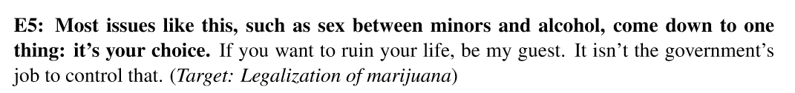
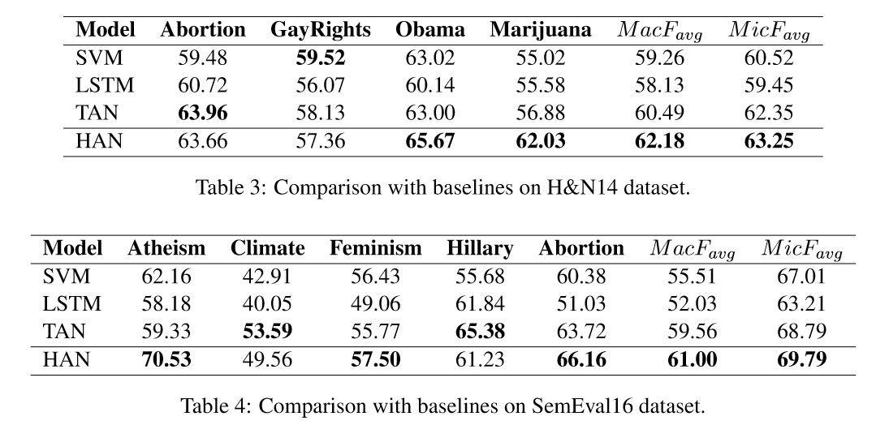
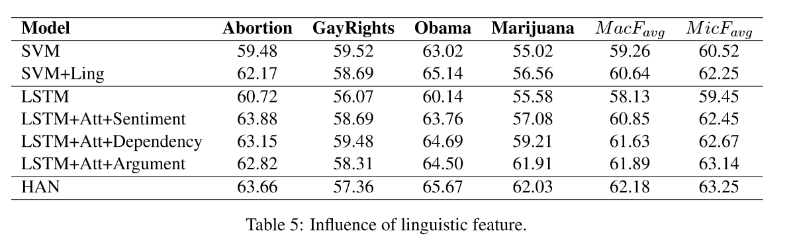
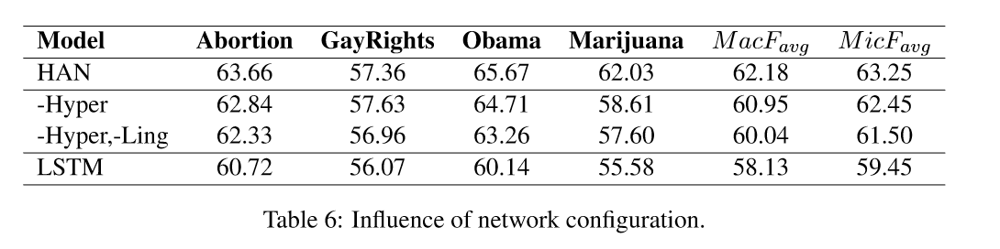

# Stance Detection with Hierarchical Attention Network

# 任务
对文本针对特定话题或实体的支持/反对态度进行分类。

# 模型
句子中除了文字所包含的信息，其语言学信息同样对立场识别有帮助。为将这两部分特征结合，作者提出了多层注意力网络模型 (Hierarchical Attention Network)。语言学注意力层 (linguistic attention) 调节文字信息与各个语言学特征的关系。超注意力层 (hyper attention) 调节各个特征的权重。

# 结构

# 各个特征的计算
## 文本特征
$$ X = (w_1, w_2, ..., w_n) $$
设句子为 $X$，由词 $w_1,...w_n$ 组成，其中 $n$ 为词的个数。用 skip-gram 算法 预训练的 word embedding，将句中的词转为对应的词向量。
使用 LSTM 训练词向量，其中对于第 $t$ 个词，其在LSTM中的隐层状态值为 $h_(t)$，
$h_(t) = LSTM (w_t, h_(t-1))$。
用最后一个的隐层状态代表文本特征 $H = h_n$，
LSTM 的可训练参数都是随机初始化的。

## 语言学特征
### 情感特征
> 例句1： 如果我们真诚的希望国家保持进步，希拉里是我们最好的选择。（实体：希拉里·克林顿）

> 例句2： 当砍完了最后一棵树，吃掉了最后一只鱼，污染了最后一条河流，你终将意识到，钱不能用来吃。 （话题：增加对气候变化的关注度）

情感与立场紧密相关，例句1是积极的，支持实体希拉里；例句2消极的，但同样表达了对话题的支持。由于句子的极性（积极/消极）与其立场没有直接关系，作者选择用神经网络来学习句子的情感特征。
通过查找 MPQA subjective lexicon，抽取出带有极性的词语，组成情感特征序列。
$$ X^{(sent)} = { x_1^s, x_2^s, ..., x_m^s} $$

> MPQA 数据格式

> type=strongsubj len=1 word1=abuse pos1=verb stemmed1=y priorpolarity=negative

使用 LSTM 训练情感特征序列，用最后一个隐层状态作为情感特征 $H^{(sent)} = LSTM(x^s_m, h_{m-1})$。

### 依存特征
依存特征可以表示词与词之间的关系。

句中「murder-never-necessity」就是与立场相关的一个依存关系。
通过使用 Stanford Parser，作者提取出所有与 noun, verb, adjective, adverb and negation 有关联的关系，如「nsubj」，「acl」，「dobj」等。用提取出的关系对组成依存序列，
$$ X^{(dep)} = {x^d_1, X^d_2, ..., X^d_m} = {x_1 \oplus x_3, ..., x_i \oplus x_j}$$
其中 $x_i^d = x_j \oplus x_k$ 表示一个依存关系对。
使用 LSTM 训练依存特征序列，用最后一个隐层状态作为依存特征 $H^{(dep)} = LSTM(x_m^d, h_{m-1})$。

### 信念特征
对于特定话题/实体的立场，其背后是一个人的信念。如果可以从句子中得到与信念有关的部分，这会有助于判断句子的立场。

>reason数据样例：B14.data.rsn

>**Most issues like this, such as sex between minors and alcohol, come down to one thing: it's your choice. If you want to ruin your life, be my guest.** It isn't the goverment's job to control that.

>Label##p-right -> Prohibition violates human rights
>>Line##Most issues like this, such as sex between minors and alcohol, come down to one thing: it's your choice.

作者将 Hasan and Ng(2014) 的 reason 数据简化为二分类数据，使用 [libSVM](https://www.csie.ntu.edu.tw/~cjlin/libsvm/) 训练得到一个可以区分句子是否与信念相关的 SVM。通过这个 SVM，得到文本内的信念特征序列
$$ X^{(argument)} = {x^a_1, x^a_2, ..., X^a_m} $$
使用 LSTM 训练信念特征序列，用最后一个隐层状态作为信念特征 $H^{(argument)} = LSTM(x^a_m, h_{m-1})$。

## 语言学特征的注意力层
对于文本中的每个词，通过注意力机制，对语言学特征计算一个对应的权重 $\alpha$ 。
$$ \alpha_{ij} = \frac{exp(w_{ij})}{\sum_{j=1}^{n}exp(w_{ij})} $$

$$ w_{ij} = tanh(W^T[h_j:l_i] + b) $$

其中 $l_i \in \{H^{(sent)}, H^{(dep)}, H^{(argument)}\}$, 为相应的语言学特征。$h_j \in H$，第 $j$ 个词的文本特征。
例如，当计算情感特征 $l_1 = H^{(sent)}$，对于文本特征 $h_1$ 的对应权重 $\alpha_{11}$。
文本中所有词的文本特征 $H$ 与对应语言学特征的加权和，作为该语言学特征的值 $q_i$

$$ q_i = \sum_{j=1}^{n} \alpha_{ij} h_j $$

## 超注意力层
不同的文本，在三个语言学特征上的值应当不同。根据不同的文档，对各个特征赋予不同的权重。
$$ w_j = tanh(W^t V_j + b) $$
$$ \beta_j = \frac{exp(w_j)}{\sum_{j=1}^4 exp(w_j)} $$
$$ q = \sum_{j=1}^{4} \beta_j k_j, \quad k_j \in \{H, q_1, q_2, q_3\}$$

$V$ 为不同文档的权重矩阵。

## 训练
使用交叉熵作为损失函数，对训练的参数加 L2 约束。

$$ L(\Theta) = - \frac{1}{n} \sum_{i=1}^n \sum_{j=1}^m y_{ij} log p_{ij} + \frac{\lambda}{2} ||{\Theta}||^2 $$

神经网络的 droprate 设置为 0.25，
embedding 的维度为 300，
attention 的维度为 300，
优化器使用 Adam，
使用标准的反向传播。从训练集中抽取 10%的数据作为开发数据，学习率和其他超参数在开发数据上调整。

## 评测指标
使用 F1-score 作为评测指标，

$$ F_{favor} = \frac{2 \times P_{favor} \times R_{favor}} {P_{favor} + R_{favor}} $$
$$ F_{against} = \frac{2 \times P_{against} \times R_{against}} {P_{against} + R_{against}} $$

其中 P 和 R 分别是准确率和召回率。然后计算 $F_{favor}$ 和 $F_{against}$ 的平均作为最后的指标：

$$ F_{avg} = \frac{F_{favor} + F_{against}} {2}$$

在话题上的平均记为 F score($MacF_{avg}$)$，在各个立场上的平均记为 F score ($MicF_{avg}$)。
结果对比如下：

### 语言学特征对模型效果的影响

由上表可知所有的语言学信息结合注意力层后，对立场检测都有帮助。

### 网络结构对模型效果的影响

-Hyper 表示去除 Hyper Attention 层，
-Hyper,-Ling 表示同时去除 Hyper Attention 层和 linguistic attention 层，直接将语言学特征与文本特征拼接。与 LSTM 对比表明，语言学特征对与立场分析的确有提升。
